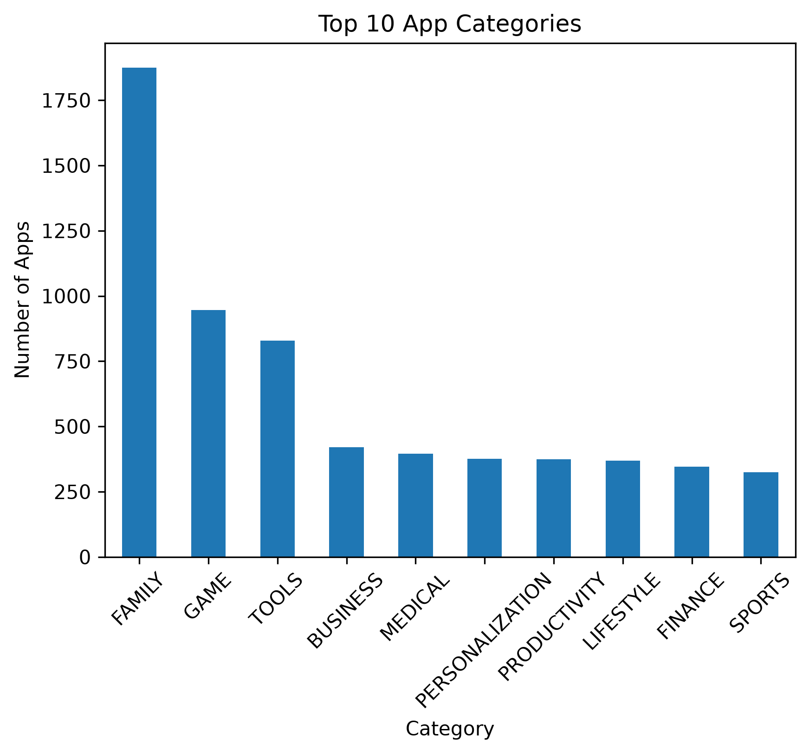
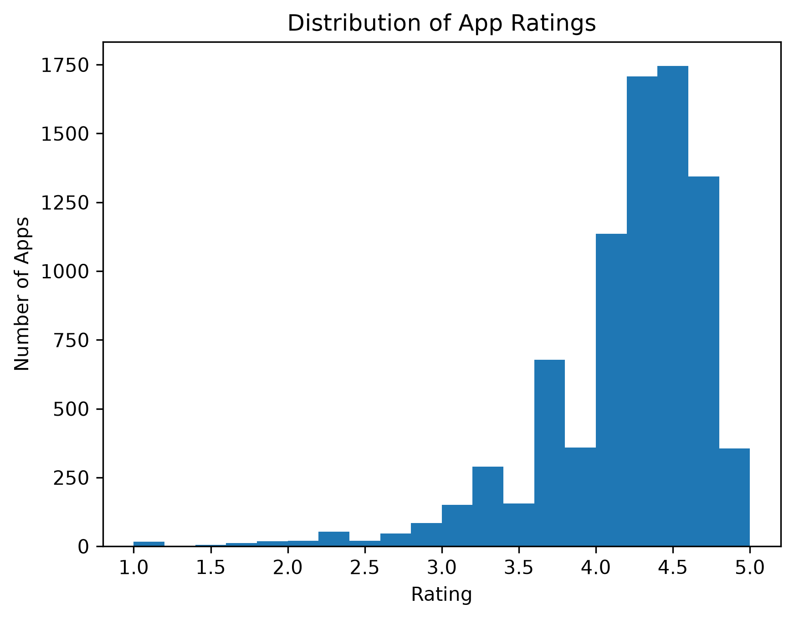
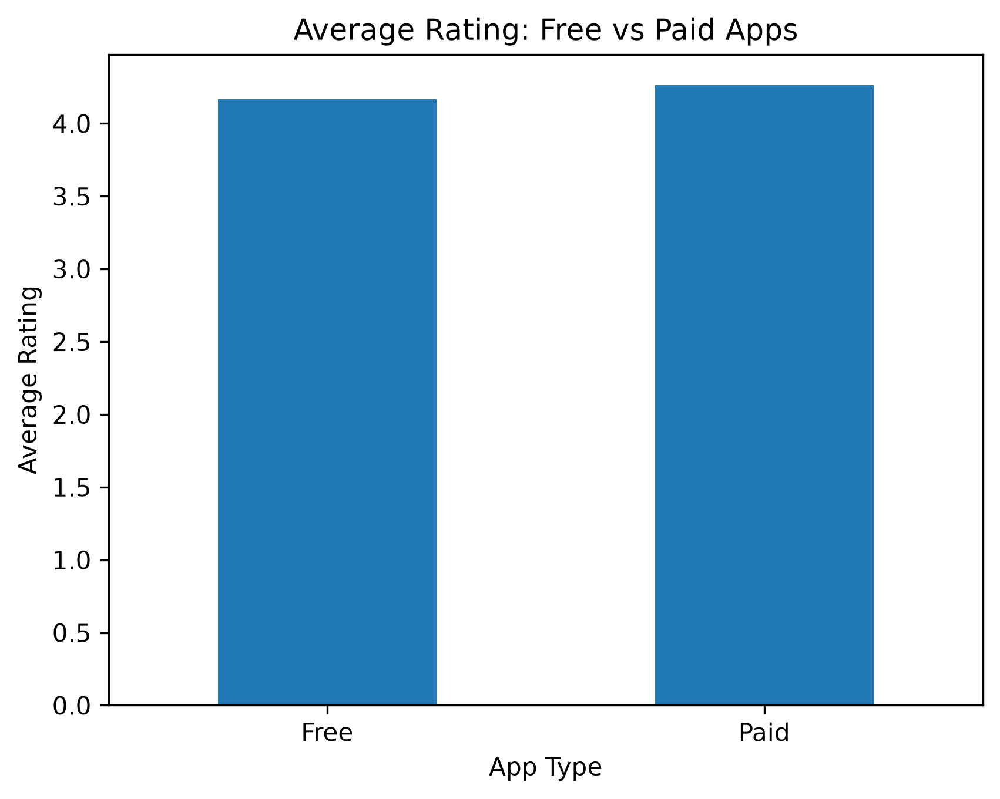
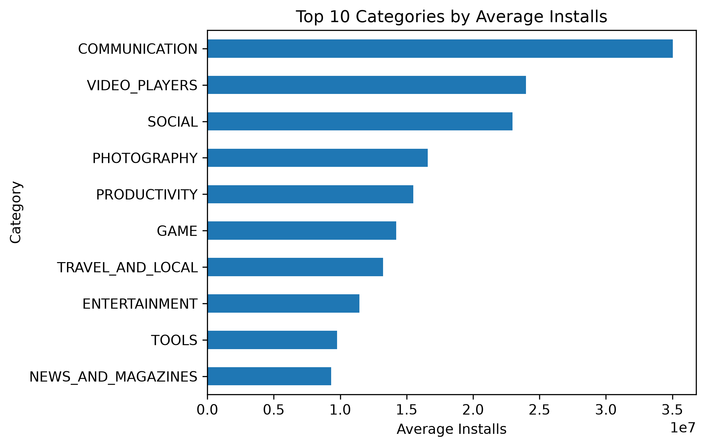
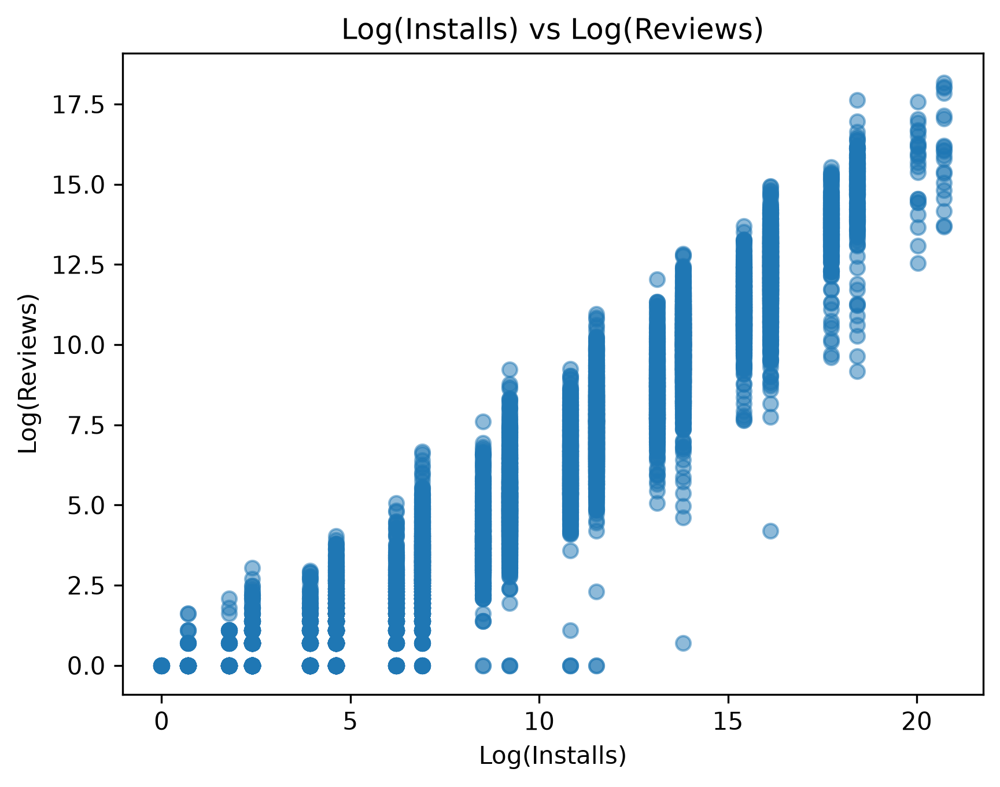
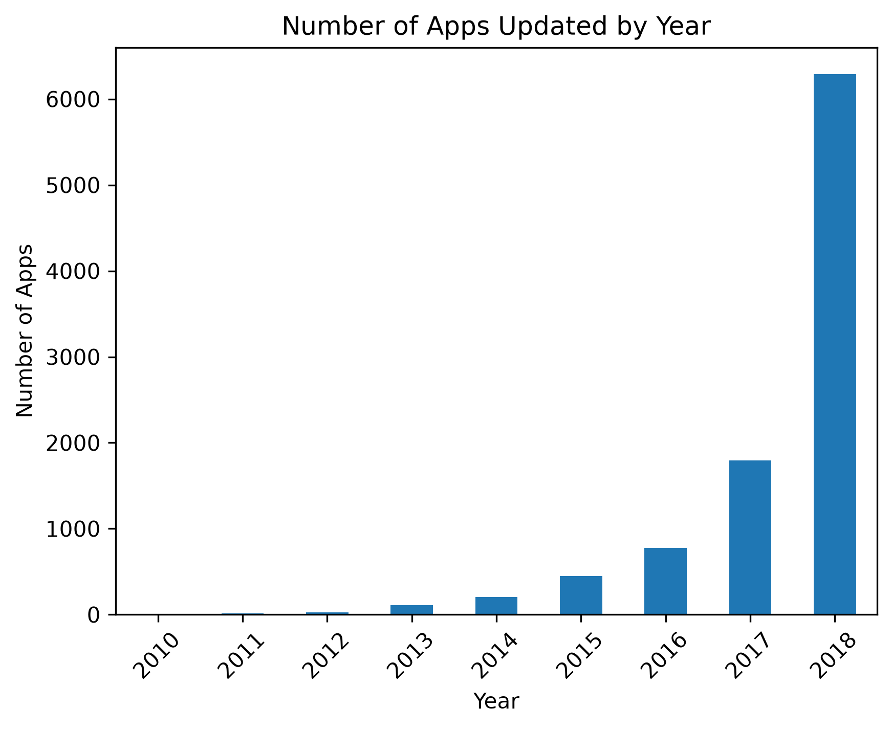

# 📊 Google Play Store App Analysis

## 📌 Project Overview

This project analyzes Google Play Store application data to identify patterns and insights related to app ratings, reviews, installs, pricing, categories, and other application attributes.

The dataset contains information on 10,000+ applications and was analyzed using Python and Pandas.

## 🎯 Objectives

- Understand the distribution of apps across different categories
- Analyze app ratings and review counts
- Identify patterns in app installations
- Examine free vs. paid applications
- Analyze app pricing and size
- Explore relationships between reviews, ratings, and installs
- Identify trends and patterns within the Google Play Store dataset

## 🛠️ Tools & Technologies

- Python
- Pandas
- NumPy
- Matplotlib
- Jupyter Notebook
- Exploratory Data Analysis (EDA)

## 🧹 Data Cleaning

The raw dataset required several preprocessing steps before analysis:

- Handled missing values
- Removed duplicate app entries
- Cleaned the `Installs` column by removing commas and `+` symbols
- Converted installation counts into numerical values
- Cleaned the `Price` column by removing currency symbols
- Processed the `Size` column
- Standardized data types for analysis

## 📈 Analysis Performed

The project includes exploratory analysis of:

- App categories
- Ratings
- Reviews
- Installs
- Pricing
- App size
- Content ratings
- Genres

Statistical summaries and visualizations were used to identify patterns and generate insights from the dataset.

## 📊 Visualizations

### Top 10 App Categories



### Rating Distribution



### Average Rating: Free vs Paid Apps



### Top 10 Categories by Average Installs



### Installs vs Reviews



### Apps Updated by Year



## 💡 Key Findings & Conclusion

The analysis provided several insights into the characteristics and performance of applications on the Google Play Store:

- Free applications represent a significantly larger proportion of the dataset compared with paid applications.
- Apps with higher numbers of reviews generally tend to have higher installation counts, indicating a relationship between user engagement and app popularity.
- Most applications have ratings concentrated around the 4.0–4.5 range.
- A relatively small number of highly popular applications account for a large share of total installations.
- App categories differ considerably in terms of the number of applications, ratings, reviews, and installations.
- The analysis also highlighted the importance of data cleaning and preprocessing, particularly for columns such as `Installs`, `Price`, and `Size`.

Overall, the project demonstrates how data cleaning, exploratory data analysis, statistical summaries, and visualization can be used to uncover meaningful patterns in real-world application data and support data-driven insights.

## 📂 Project Structure

```text
Google-Play-Store-Analysis/
│
├── Google_Play_Store_Analysis.ipynb
├── googleplaystore.csv
└── README.md
